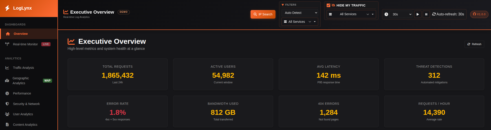

# LogLynx 🦁📊

**Advanced Log Analytics Platform for Traefik and Beyond**

LogLynx is a high-performance (less than 50 MB of RAM), real-time log analytics platform designed to provide deep insights into your web traffic. Built with Go and optimized for Traefik reverse proxy logs, it offers a beautiful dark-themed dashboard and comprehensive REST API.


> **📚 Important Documentation**
>
> - **[Traefik Setup Guide](../../wiki/Traefik)** - Recommended Traefik configuration for optimal LogLynx performance and complete field capture (for the [pangolin quick installation](https://docs.pangolin.net/self-host/quick-install) no additional configuration is required for Traefik).
> - **[Deduplication System](../../wiki/Deduplication-System)** - Learn how LogLynx prevents duplicate log entries and handles various scenarios (log rotation, crashes, re-imports)



## ✨ Features

- 📊 **Real-time Analytics** - Live metrics with Server-Sent Events (SSE)
- 🗺️ **Geographic Insights** - Interactive maps with traffic visualization
- 📈 **Timeline Analysis** - Hourly, daily, and custom time ranges
- 🔍 **Deep Filtering** - Filter by service, backend, or domain
- 🚀 **High Performance** - Optimized batch processing and SQLite backend
- 🎨 **Beautiful UI** - Dark-themed responsive dashboard
- 🔌 **REST API** - Full-featured API for integrations
- 📱 **Device Analytics** - Browser, OS, and device type detection
- 🌐 **GeoIP Enrichment** - Country, city, and ASN information
- 🔄 **Auto-Discovery** - Automatically detects Traefik log files

## 🚀 Quick Start

### Prerequisites

- Go 1.25 or higher
- Traefik access logs (optional for initial setup)

### Standalone installation

```bash
# Clone the repository
git clone https://github.com/k0lin/loglynx.git
cd loglynx

# Customize your installation (None of these parameters are mandatory, but customization for your system is recommended.)
cp .env.example .env

# Install dependencies
go mod tidy
```
#### Now there are two deployment methods:
Creating the binary to be executed
```bash
# Build
go build -o loglynx cmd/server/main.go

# Start the server
./loglynx
```
Run the service directly without creating the binary
```bash
# Build and run
go run cmd/server/main.go

```

### Deployment with docker compose on standard pangolin installation
This should be your pangolin installation in broad terms if you used the installer from the official documentation.
```
your-folder/
├── config/                    # Pangolin configuration
│   └── traefik/ 
│   │  └── logs/
│   │     └── access.log       # Traefik access log
│   ├── logs/       
│   ├── letsencrypt/     
│   ├── db/      
│   ├── config.yml
│   ├── GeoLite2-City.mmdb     # optional
│   ├── GeoLite2-ASN.mmdb      # optional
│   └── GeoLite2-Country.mmdb  # optional
├── loglynx-data/                      # database for loglynx service   
├── GeoLite2-Country_20251024/ # MaxMind license
└──  docker-compose.yml 
```
This is the deployment of Docker Compose, which will also contain services such as Pangolin, Traefik, etc. The example configuration is set up using the Pangolin configuration described above.
```yml
#other service related to pangolin

loglynx:
    image: k0lin/loglynx:dev
    container_name: loglynx
    restart: unless-stopped
    ports:
      - "8080:8080"
    volumes:
      - ./loglynx-data:/data
      - ./config:/app/geoip                 
      - ./config/traefik/logs:/traefik/logs
    environment:
      - DB_PATH=/data/loglynx.db
      - GEOIP_ENABLED=true  #if the geolite database are installed
      - GEOIP_CITY_DB=/app/geoip/GeoLite2-City.mmdb  #only if GEOIP_ENABLED is set to true, It is not mandatory to set all three, even just one is fine (obviously it will work with limited functionality)
      - GEOIP_COUNTRY_DB=/app/geoip/GeoLite2-Country.mmdb  #(only if GEOIP_ENABLED is set to true), It is not mandatory to set all three, even just one is fine (obviously it will work with limited functionality)
      - GEOIP_ASN_DB=/app/geoip/GeoLite2-ASN.mmdb  #(only if GEOIP_ENABLED is set to true), It is not mandatory to set all three, even just one is fine (obviously it will work with limited functionality)
      - TRAEFIK_LOG_PATH=/traefik/logs/access.log
      - LOG_LEVEL=info
      - SERVER_PRODUCTION=false
      # There are several configurable environment variables to optimize program startup (check the wiki).
```

The dashboard will be available at `http://localhost:8080`

## 📊 Dashboard

Access the web interface at `http://localhost:8080` to explore:

- **Overview** - Executive summary with key metrics
- **Real-time Monitor** - Live traffic monitoring
- **Traffic Analysis** - Patterns and trends over time
- **Geographic Analytics** - Interactive world map
- **Performance** - Response times and backend health
- **Security & Network** - IP analysis, ASN tracking, TLS versions
- **User Analytics** - Browsers, OS, device types, referrers
- **Content Analytics** - Top paths and referrers
- **Backend Health** - Service performance monitoring

## 🔌 API Usage

LogLynx provides a comprehensive REST API for programmatic access to all analytics.

### API-Only Mode

You can disable the dashboard UI and run LogLynx in API-only mode by setting:

```bash
DASHBOARD_ENABLED=false
```

When dashboard is disabled:
- All `/api/v1/*` endpoints remain fully accessible
- `/health` endpoint continues to work for health checks
- Dashboard routes (`/`, `/traffic`, etc.) are not exposed
- Static assets are not loaded, reducing memory footprint

### OpenAPI Specification

Full API documentation is available in `openapi.yaml`. View it with:

- [Swagger Editor](https://editor.swagger.io/) - Paste the content
- [Swagger UI](https://petstore.swagger.io/) - Import the file
- Generate clients: `npx @openapitools/openapi-generator-cli generate -i openapi.yaml -g python`

See the [API Wiki](../../wiki/API-Documentation) for detailed examples and use cases.

## 🛠️ Configuration

### Environment Variables

```bash
# ================================
# GeoIP Configuration
# ================================
# Download GeoIP databases from MaxMind:
# https://dev.maxmind.com/geoip/geolite2-free-geolocation-data

GEOIP_ENABLED=true
GEOIP_CITY_DB=geoip/GeoLite2-City.mmdb
GEOIP_COUNTRY_DB=geoip/GeoLite2-Country.mmdb
GEOIP_ASN_DB=geoip/GeoLite2-ASN.mmdb

# ================================
# Log Sources Configuration
# ================================
# Path to Traefik access log file
TRAEFIK_LOG_PATH=traefik/logs/access.log
```


### GeoIP databases

Some community projects (for example, [`P3TERX/GeoLite.mmdb`](https://github.com/P3TERX/GeoLite.mmdb)) provide convenient downloads of GeoLite2 City/Country/ASN files. LogLynx does not ship GeoIP databases and is not responsible for third-party downloads.

If you use third-party downloaders, please ensure you comply with MaxMind's license and, when required, register and accept the license on the official MaxMind site: [MaxMind GeoLite2](https://dev.maxmind.com/geoip/geolite2-free-geolocation-data).

To use GeoIP with LogLynx, place the `.mmdb` files in a directory and mount that directory into the container at the paths configured by `GEOIP_CITY_DB`, `GEOIP_COUNTRY_DB` and `GEOIP_ASN_DB`.


### Traefik Log Format

LogLynx works best with Traefik's default access log format. Ensure Traefik is configured with:

```yaml
accessLog:
  filePath: "/var/log/traefik/access.log"
  format: json  # JSON format recommended
```

## 📦 Project Structure

```
loglynx/
├── cmd/server/          # Application entry point
├── internal/
│   ├── api/            # HTTP server and handlers
│   ├── database/       # Database models and repositories
│   ├── enrichment/     # GeoIP enrichment
│   ├── ingestion/      # Log file processing
│   ├── parser/         # Log format parsers
│   └── realtime/       # Real-time metrics
├── web/
│   ├── static/         # CSS, JavaScript, images
│   └── templates/      # HTML templates
├── openapi.yaml        # API specification
└── README.md
```

## 🔒 Features in Detail

### Resilient Startup
- ✅ Starts successfully even without log files
- ✅ Automatic retry with clear error messages
- ✅ Graceful handling of permission errors
- ✅ Runs in standby mode until logs are available

### Real-time Monitoring
- Live metrics updated every second
- Server-Sent Events (SSE) streaming
- Per-service breakdown
- Active connections and error rates

### Geographic Analytics
- Interactive Leaflet map with clustering
- Country, city, and coordinate data
- ASN (Autonomous System) tracking
- Dark-themed map styling

### Performance Tracking
- Response time percentiles (P50, P95, P99)
- Backend health monitoring
- Bandwidth analysis
- Request rate tracking

## 🤝 Contributing

Contributions are welcome! Please feel free to submit a Pull Request. For major changes, please open an issue first to discuss what you would like to change.

## 📝 License

This project is licensed under the MIT License - see the [LICENSE](LICENSE) file for details.

## 🙏 Acknowledgments

- [Traefik](https://traefik.io/) - Modern HTTP reverse proxy
- [MaxMind GeoLite2](https://dev.maxmind.com/geoip/geolite2-free-geolocation-data) - GeoIP databases
- [DataTables](https://datatables.net/) - Table plugin for jQuery
- [Chart.js](https://www.chartjs.org/) - JavaScript charting
- [Leaflet](https://leafletjs.com/) - Interactive maps

## 💬 Support

- 🐛 [Report Issues](../../issues)
- 💡 [Feature Requests](../../issues/new?labels=enhancement)
- 📖 [Documentation Wiki](../../wiki)

---

**Made with ❤️ for the community**


